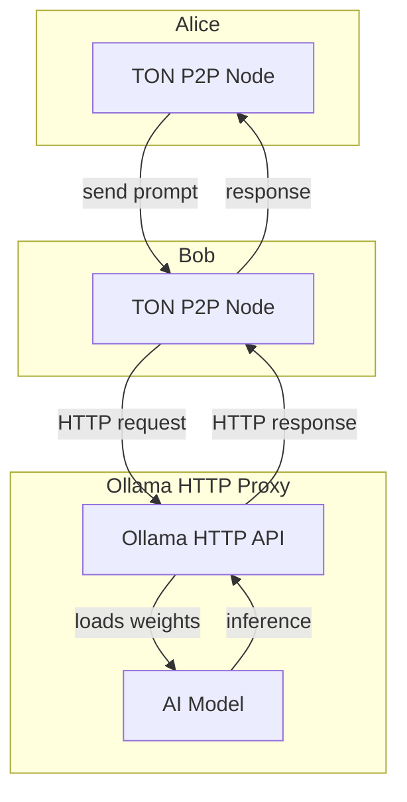
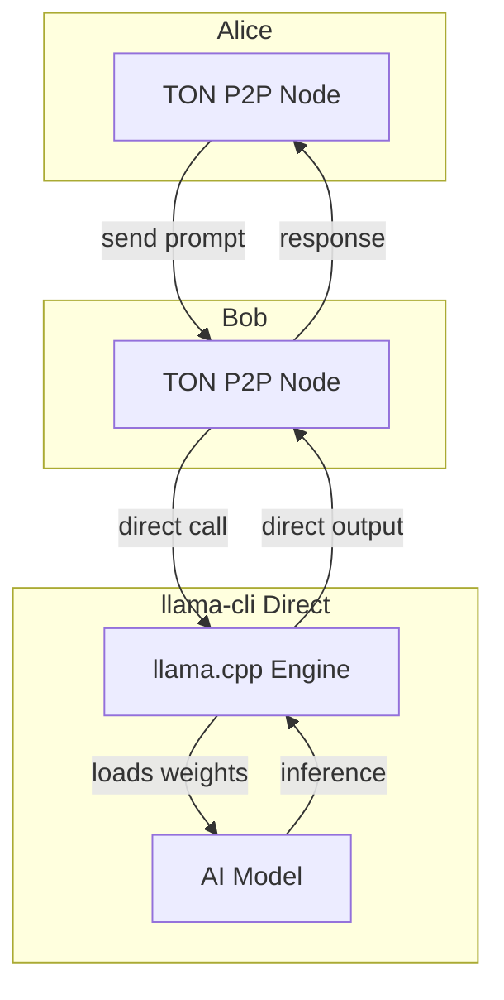

# 🌐 sddao-v1

> **P2P chat application using The Open Network (TON)**

[](https://golang.org)

🎥 Watch video demo on [PeerList](https://peerlist.io/designervoid/project/sddao)

## 🆕 What's New in 0.0.3

- **Ollama CLI integration** – you can now send prompts to a local Ollama over TON (`./sddao-p2p-0.0.3-aarch64 AI-Robot <ip> <port> ollama`)
- New command: `/ollama <peer_key> <model> <prompt>`  

## 🆕 What's New in 0.0.4

Download `DeepSeek-R1-Distill-Qwen-1.5B-GGUF` [here](https://huggingface.co/lmstudio-community/DeepSeek-R1-Distill-Qwen-1.5B-GGUF)

- **llama-cli integration** – you can now send prompts to a model using llama-cli over TON (`./sddao-p2p-0.0.4-aarch64 AI-Robot <ip> <port> llama-cli`)
- New command: `/ai <peer_key> <model> <prompt>`  

## Dependencies

This project uses the following open-source libraries:

- [`tonutils-go`](https://github.com/xssnick/tonutils-go) – Provides core TON networking primitives including ADNL, DHT, and RLDP, enabling true P2P connectivity and message delivery.
- [`ollama`](https://github.com/ollama/ollama) – Local AI models provider; `ollama` under the hood runs directly on user device with HTTP proxy. Peer-to-peer communication between nodes occurs over TON. 



- [`llama.cpp`](https://github.com/ggml-org/llama.cpp) – Another local AI models provider; `llama-cli` under the hood runs directly on user device without HTTP proxy, enabling agents to respond to peer prompts entirely locally. 



## ✨ Features

🔒 True P2P Communication – Direct peer-to-peer messaging without central servers.

📡 Large Message Support – Delivery of encrypted messages up to 10MB.

🔐 End-to-End Encryption – Messages secured with one-time ed25519 keys.

⚙️ Cross-Platform – Data can be exchanged wirelessly between macOS and Android over Wi-Fi (see how it [works](https://peerlist.io/designervoid/project/sddao), this repo contains only the Linux build).

👁️‍🗨️ No tracking – We’re not watching you.

## 🚀 Quick Start

### Prerequisites
- Go 1.23 or higher
- cosign (to verify builder email)

### Install `config.json`

Download TON Mainnet Config (https://ton.org/global-config.json) to `config.json` in directory with binary 

### Install `ollama` (0.0.3, 0.0.4)

You need to install ollama cli and model e.g `deepseek-r1:1.5b`. Find how to install `ollama` [here](https://github.com/ollama/ollama).

### Install `llama-cli` (0.0.4)

Find how to install `llama-cli` [here](https://github.com/ggml-org/llama.cpp).

### Running Nodes

#### 0.0.2

```bash
# Start first node (Alice)
./sddao-p2p-0.0.2-aarch64 Alice <ip> <port>

# Start second node (Bob) 
./sddao-p2p-0.0.2-aarch64 Bob <ip> <port>
```

#### 0.0.3

```bash
# Start first node (Alice)
./sddao-p2p-0.0.3-aarch64 Alice <ip> <port>

# Start second node (Bob) 
./sddao-p2p-0.0.3-aarch64 Bob <ip> <port>

# Start third node (AI-Robot)
./sddao-p2p-0.0.3-aarch64 AI-Robot <ip> <port>
```

#### 0.0.4

```bash
# Start first node (Alice)
./sddao-p2p-0.0.3-aarch64 Alice <ip> <port>

# Start second node (Bob) 
./sddao-p2p-0.0.3-aarch64 Bob <ip> <port>

# Start third node (AI-Robot)
./sddao-p2p-0.0.3-aarch64 AI-Robot <ip> <port> <ai_provider> # ollama || llama-cli
```


## Verify builder email via `cosign`

Should return `Verified OK`:
```sh
# verify dsgnrvd@gmail.com
cosign verify-blob \
  --signature sddao-p2p-0.0.2-aarch64.sig \
  --certificate sddao-p2p-0.0.2-aarch64.crt \
  --bundle sddao-p2p-0.0.2-aarch64.bundle \
  --certificate-identity "dsgnrvd@gmail.com" \
  --certificate-oidc-issuer "https://github.com/login/oauth" \
  sddao-p2p-0.0.2-aarch64
```

## Verify file via `virustotal`

✅ Download files only from this repo and verify yourself on VirusTotal.

## 📋 Available Commands

Once your node is running, use these interactive commands:

| Command | Description | Example |
|---------|-------------|---------|
| `/connect <key>` | Connect to peer via DHT using public key | `/connect a1b2c3d4...` |
| `/msg <key> <text>` | Send message via RLDP | `/msg a1b2c3d4... Hello!` |
| `/ollama <peer_key> <model> <prompt>` (0.0.3 only) | Send prompt to a local Ollama instance over TON | `/ollama a1b2c3d4... deepseek-r1:1.5b hey` |
| `/ai <peer_key> <model> <prompt>` (0.0.4 only) | Send prompt to a local Ollama or llama-cli instance over TON | `/ai a1b2c3d4... deepseek-r1:1.5b hey OR /ai a1b2c3d4... DeepSeek-R1-Distill-Qwen-1.5B-Q8_0.gguf hey` |
| `/list` | Show connected peers | `/list` |
| `/exit` | Exit the application | `/exit` |

## 🌍 Network Connectivity

### IP Address Considerations

| Connection Type | Status | Description |
|----------------|--------|-------------|
| **Public + Public** | ✅ Good | Both nodes have public IPs |
| **Private + Private** | ✅ Good | Both nodes on same local network |

### Network Requirements

- **Public IPs** - Recommended for global connectivity
- **Local Network** - Works well for private deployments

## 📖 Example Usage

### 0.0.2 Linux

1. **Start Alice Node**
   ```bash
   ./sddao-p2p-0.0.2-aarch64 Alice 127.0.0.0 8080
   ```
   *Output: Alice public key will be displayed*

2. **Start Bob Node**
   ```bash
   ./sddao-p2p-0.0.2-aarch64 Bob 127.0.0.0 8081
   ```
   *Output: Bob public key will be displayed*

3. **Establish Connection**  

   In Alice terminal:
   ```bash
   /connect <Bob_public_key>
   ```

   In Bob terminal:
   ```bash
   /connect <Alice_public_key>
   ```

4. **Send Messages**
   ```bash
   # From Bob to Alice
   /msg <Alice_public_key> Hello Alice!
   
   # From Alice to Bob  
   /msg <Bob_public_key> Hi Bob!
   ```

### 0.0.3 Linux

1. **Start AI-Robot Node**
   ```bash
   ./sddao-p2p-0.0.3-aarch64 AI-Robot 127.0.0.0 8080
   ```
   *Output: AI-Robot public key will be displayed*

2. **Start Alice Node**
   ```bash
   ./sddao-p2p-0.0.3-aarch64 Alice 127.0.0.0 8081
   ```
   *Output: Alice public key will be displayed*

3. **Establish Connection**  

   In Alice terminal:
   ```bash
   /connect <AI-Robot_public_key>
   ```

3. **Send message to AI-Robot**  

   In Alice terminal:
   ```bash
   /ollama <AI-Robot_public_key> deepseek-r1:1.5b hey
   ```

### 0.0.4 Linux

1. **Start AI-Robot Node**
   ```bash
   ./sddao-p2p-0.0.4-aarch64 AI-Robot 127.0.0.0 8080 llama-cli
   ```
   *Output: AI-Robot public key will be displayed*

2. **Start Alice Node**
   ```bash
   ./sddao-p2p-0.0.4-aarch64 Alice 127.0.0.0 8081
   ```
   *Output: Alice public key will be displayed*

3. **Establish Connection**  

   In Alice terminal:
   ```bash
   /connect <AI-Robot_public_key>
   ```

3. **Send message to AI-Robot**  

   If you using `llama-cli`,
   In Alice terminal:
   ```bash
   /ai <AI-Robot_public_key> DeepSeek-R1-Distill-Qwen-1.5B-GGUF hey
   ```

   If you using `ollama`,
   In Alice terminal:
   ```bash
   /ai <AI-Robot_public_key> deepseek-r1:1.5b hey
   ```
    

### Android

Use [Termux](https://termux.dev/en/).

Inside `termux` you should have `wget` & `git`.  

Run sddao-v1 directly on your Android phone using Termux – a lightweight Linux environment and terminal emulator for Android.  

```sh
git clone git@github.com:systemdesigndao/sddao-v1-builds-public.git 

cd sddao-v1-builds-public 

wget https://ton.org/global-config.json -O config.json

chmod +x sddao-p2p-0.0.2-aarch64

./sddao-p2p-0.0.2-aarch64 <name> <ip> <port>

# connect then exchange messages
```

### Security Features

- **Key Generation** - Each node generates unique ed25519 key pair
- **Message Encryption** - All traffic encrypted end-to-end

### Performance Characteristics

- **Message Size** - Up to 10MB per message
- **Latency** - Sub-second message delivery

**Built on TON**
